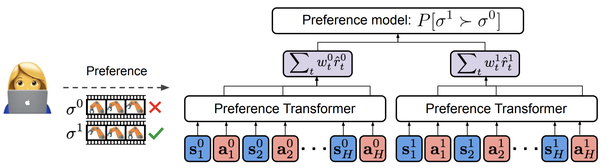
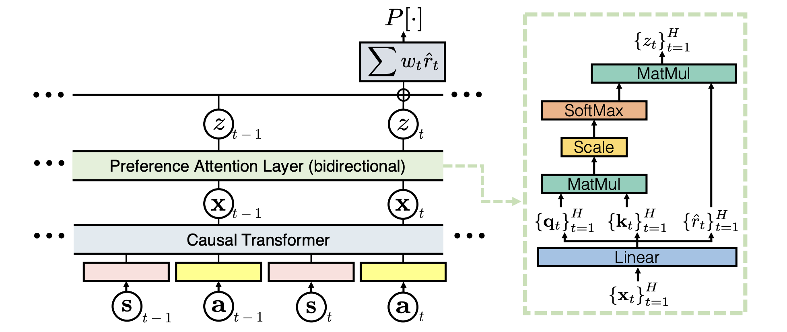

# AI611 Team 16: Preference Transformer Notebook Report

<p align="center">
  
</p>

<p align="center">
  <em>Figure 1. Overview of the Framework. Source: official Preference Transformer paper.</em>
</p>

<p align="center">
  
</p>

<p align="center">
  <em>Figure 2. Overview of Preference Transformer. Source: official Preference Transformer paper.</em>
</p>

—--

## Paper Information

* **Title:** *Preference Transformer: Modeling Human Preferences using Transformers for RL*
* **Authors:** Changyeon Kim, Jongjin Park, Jinwoo Shin, Honglak Lee, Pieter Abbeel, Kimin Lee
* **Venue:** ICLR 2023
* **Topic:** Preference-based Reinforcement Learning, Human Preference Modeling, Offline RL
* **Official implementation:** JAX/Flax
* **Official repository:** https://github.com/csmile-1006/PreferenceTransformer
* **Project page:** https://sites.google.com/view/preference-transformer
* **OpenReview:** https://openreview.net/forum?id=Peot1SFDX0

---

## TL;DR

Preference Transformer is a Transformer-based reward model for preference-based reinforcement learning. Instead of assuming that human preference can be explained by a simple sum of Markovian rewards, it models preference as a **weighted sum of non-Markovian rewards**. This allows the model to use the temporal context of a trajectory segment and to assign higher importance to critical moments that strongly affect human judgment.

In this notebook, we use the paper as a foundation for a tutorial-style reproduction on `antmaze-medium-play-v2`, then extend the analysis with additional experiments on preference budget, segment length, and a direct preference-conditioned policy variant.

---

## Summary

### 1. Problem Setting

Preference-based reinforcement learning learns from comparisons between two behavior segments rather than from a hand-designed reward function. A human or labeler is shown two trajectory segments and provides a preference label indicating which segment is better.

This is useful because reward engineering can be difficult in long-horizon control tasks such as AntMaze. However, learning a reliable reward model from limited human preferences is challenging. Many prior methods assume that human preference is generated from a Markovian reward function:

$$
R(\sigma) = \sum_t r(s_t, a_t)
$$

For two trajectory segments $\sigma^0$ and $\sigma^1$, the preference probability is often modeled as:

$$
P(\sigma^1 \succ \sigma^0) =
\frac{\exp(R(\sigma^1))}
{\exp(R(\sigma^0)) + \exp(R(\sigma^1))}
$$

This formulation is simple, but it assumes that each timestep contributes equally through a local reward. In many realistic tasks, human preference depends on temporal context, progress over time, and a few critical events.

---

### 2. Main Idea of Preference Transformer

The paper argues that human preferences are better modeled with **non-Markovian rewards**. In other words, the reward at a timestep should be allowed to depend on the surrounding trajectory context, not only on the current state and action.

Preference Transformer implements this idea with two main components:

1. **Causal Transformer**

   * Takes a trajectory segment as a sequence.
   * Produces hidden embeddings that summarize historical context up to each timestep.
   * Allows each timestep representation to depend on previous states and actions.

2. **Preference Attention Layer**

   * Uses bidirectional self-attention over the trajectory segment.
   * Predicts non-Markovian reward estimates.
   * Predicts importance weights for different timesteps.
   * Aggregates them into a weighted trajectory-level preference score.

The resulting segment score can be interpreted as:

$$
R(\sigma) = \sum_t w_t \hat{r}_t
$$

where $\hat{r}_t$ is a non-Markovian reward estimate and $w_t$ is the learned importance weight for timestep $t$.

---

### 3. Why This Matters

The key advantage of Preference Transformer is that it can focus on important events in a trajectory. For example, in AntMaze, a trajectory segment may contain many uninformative steps, but a few moments can reveal whether the agent is moving through the correct corridor, approaching the goal, or getting stuck.

A Markovian reward model may struggle to distinguish these cases because it scores each state-action pair locally. Preference Transformer can use temporal context and attention weights to produce a reward signal that better matches human judgment.

The paper reports that Preference Transformer can solve several control tasks using real human preferences, while prior Markovian approaches can fail. It also shows that the learned attention weights can align with critical events in the trajectory.

---

### 4. Baselines Discussed in This Notebook

This notebook follows the official codebase structure and focuses on the following reward-model families:

* **MR:** Markovian Reward model
  A local reward model that predicts reward from state-action information without explicit sequence-level preference attention.

* **NMR:** Non-Markovian Reward model
  A sequence-aware reward model that uses temporal information but does not use the full Preference Transformer attention mechanism.

* **PT:** Preference Transformer
  The paper’s proposed Transformer-based reward model using non-Markovian rewards and learned importance weighting.

The official pipeline first trains a reward model from human preference labels, then uses the learned reward model to relabel offline data and train an offline RL policy, such as IQL.

---

### 5. How This Notebook Uses the Paper

This notebook is designed as a **tutorial-style reproduction and extension** rather than a full reproduction of every experiment in the paper.

The notebook focuses on one D4RL environment:

```text
antmaze-medium-play-v2
```

The main reproduction pipeline is:

1. **Environment and dependency check**

   * Verifies Python, CUDA, JAX, Gym, D4RL, MuJoCo-related packages, and logging dependencies.

2. **Experiment configuration**

   * Fixes the task to `antmaze-medium-play-v2`.
   * Uses a Preference Transformer reward model.
   * Sets the baseline preference query length and IQL configuration.

3. **D4RL dataset cache**

   * Checks whether the AntMaze dataset is already cached.
   * Uses D4RL dataset loading when needed.

4. **Human preference label inspection**

   * Verifies that human preference label files exist.
   * Loads preference pair indices and labels.
   * Visualizes one labeled AntMaze trajectory-pair example.

5. **Preference Transformer reward-model training**

   * Trains the PT reward model from human labels.
   * Uses the official `JaxPref/new_preference_reward_main.py` training entry point.

6. **IQL training with learned rewards**

   * Uses the trained reward model checkpoint to relabel offline data.
   * Trains IQL with learned rewards through `train_offline.py`.

7. **Evaluation and rollout visualization**

   * Reads IQL evaluation logs.
   * Checks saved policy checkpoints.
   * Visualizes learned AntMaze rollout trajectories on a static maze layout.

This part directly supports the assignment requirement of walking through the paper and its method in a notebook-report format.

---

### 6. Notebook Extensions Beyond the Main Reproduction

After the main Preference Transformer + IQL baseline, this notebook includes three additional extensions.

#### Extension A: Multi-Context Decision Transformer OPPO

The notebook explores a direct preference-conditioned policy idea inspired by OPPO-style learning. Instead of only converting preferences into a scalar reward model before policy learning, this extension introduces multiple learned preference contexts and a Decision Transformer-style policy.

The motivation is that AntMaze requires multiple corridor-level navigation behaviors. A single global preference context may be too coarse, so the extension learns multiple contexts and uses a selector to choose among them during rollout.

This extension is based on *Beyond Reward: Offline Preference-guided Policy Optimization (OPPO)*, which proposes learning a preference-guided policy directly rather than first learning a separate scalar reward function. OPPO is useful for this notebook because it directly addresses the main limitation we observed in the PT pipeline: trajectory-level preference information can be compressed too aggressively when it is reduced to scalar rewards before IQL training.

Our novelty is not simply to re-run OPPO. Vanilla OPPO learns a single optimal context, but AntMaze is a long-horizon navigation task with different local behavior modes: moving through corridors, turning at junctions, and approaching the goal. We therefore extend the OPPO idea into **Multi-Context Decision Transformer OPPO**. Multiple learned contexts represent different navigation modes, a context selector chooses among them from recent trajectory history, and a Decision Transformer-style policy predicts actions using the selected context and goal-conditioned input.

OPPO resources: [project page](https://sites.google.com/view/oppo-icml-2023), [paper](https://proceedings.mlr.press/v202/kang23b.html), [code](https://github.com/bkkgbkjb/OPPO).

This section is exploratory and should be interpreted as an extension beyond the original Preference Transformer reproduction.

#### Extension B: Human Preference Budget Ablation

This section studies how the number of human preference labels affects reward-model learning and downstream IQL performance.

The experiment compares:

```text
Models: MR, NMR, PT
Budgets: 333, 666, 1000 preference labels
Seeds: 0, 1, 2
Environment: antmaze-medium-play-v2
```

The motivation is that preference-based RL is expensive because human feedback is costly. This ablation asks whether more preference labels consistently improve performance and whether sequence-aware models use limited preference supervision more effectively.

The observed summary in the notebook shows that PT with the full 1000-label budget achieves the best average result among the tested settings, but the trend is not strictly monotonic because AntMaze is sparse, high-variance, and contains many tie or uncertain preference labels.

#### Extension C: Segment Length Ablation

This section tests whether changing the preference segment length improves reward-model learning or downstream IQL performance.

The tested segment lengths are:

```text
query_len = 25, 50, 100, 200
```

The baseline paper-style setting uses `query_len = 100`, while this notebook checks whether shorter or longer segments are better for AntMaze.

The main result in the notebook is that all segment lengths reach saturated non-tie preference accuracy on the post-hoc evaluation split, so reward-model preference accuracy alone does not distinguish the conditions. However, downstream IQL performance differs. In this run, `query_len = 25` achieves the strongest IQL return while also being the cheapest reward-model setting.

This suggests that longer preference segments are not automatically better. A reward model can rank preference pairs correctly while still producing learned rewards that differ in usefulness for offline value learning.

---

### 7. Overall Takeaway

Preference Transformer improves preference-based RL by modeling human judgment as a sequence-level, temporally contextual decision rather than as a uniform sum of local Markovian rewards.

This notebook uses the paper as a foundation in three ways:

1. It reproduces the core Preference Transformer reward-model and learned-reward IQL pipeline on `antmaze-medium-play-v2`.
2. It explains and visualizes the human preference data used by the method.
3. It extends the baseline with additional experiments on preference budget, segment length, and direct preference-conditioned policy learning.

The most important lesson from the notebook is that local preference prediction metrics are not always sufficient. In AntMaze, the usefulness of a learned reward model must ultimately be checked through downstream policy learning and rollout behavior.
